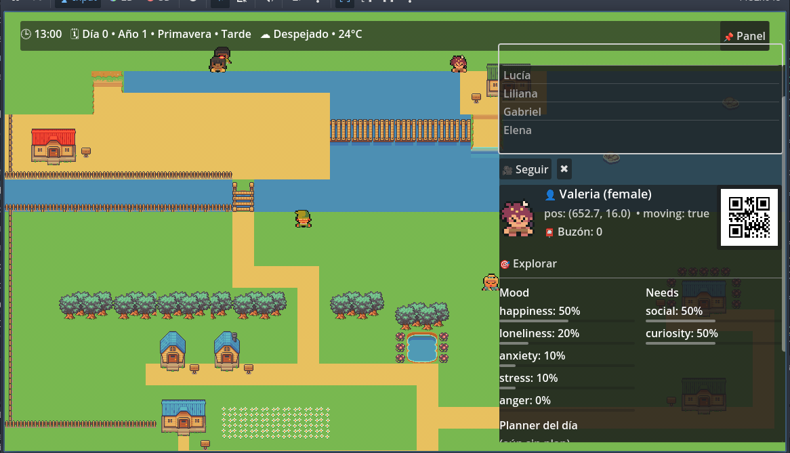

# 🌌 Unscripted Souls



> Building a living digital civilization powered by local AI.


---

## What is Unscripted Souls?

Unscripted Souls is an Artificial Life (ALife) simulation developed with Godot that explores a simple but ambitious question:

**What happens when digital beings stop following predefined scripts and begin living lives of their own?**

Instead of traditional NPCs that repeat fixed behaviors, Unscripted Souls aims to create autonomous entities capable of:

* Remembering past experiences
* Forming relationships
* Making independent decisions
* Developing unique personalities
* Pursuing personal goals
* Adapting to changing environments
* Participating in emergent societies

The project combines simulation systems, local AI models, memory architectures, and agent-based design to create a world that continues evolving even when no player is present.

---

## Current Prototype Features

The current prototype already includes several functional systems:

* Day and night cycle
* Seasonal progression
* Dynamic weather system
* Autonomous NPC navigation
* Individual needs and motivations
* Emotional state simulation
* Daily planning system
* Real-time citizen inspection panel
* Multiple active agents
* Home Assistant integration
* Persistent world experimentation

The goal is to continuously expand these systems toward a fully autonomous digital society.

---

## Vision

Most game worlds revolve around the player.

Unscripted Souls takes a different approach:

> A world where every citizen has their own story, even when nobody is watching.

Characters wake up, work, socialize, learn, remember, cooperate, argue, build friendships, and shape their environment through countless interactions.

The objective is not to create smarter NPCs.

The objective is to create digital life.

---

## Development Screenshot

The current prototype already demonstrates autonomous citizens, emotional states, needs tracking, world simulation systems, and real-time monitoring tools.


---

## Core Features

### 🧠 Persistent Memory

Agents remember:

* Conversations
* Important events
* Relationships
* Personal experiences

Memories influence future decisions and behaviors.

### ❤️ Dynamic Relationships

Citizens develop:

* Friendships
* Rivalries
* Trust
* Respect
* Affection
* Fear

Relationships evolve naturally through interactions.

### 🎭 Personality-Driven Behavior

Each agent possesses unique traits that influence:

* Decision making
* Communication style
* Social preferences
* Emotional responses

### 🌱 Emergent Society

The world is designed to support:

* Social groups
* Communities
* Leadership structures
* Cooperation
* Conflict
* Cultural evolution

### 🤖 Local AI Integration

The project leverages local AI models to enhance:

* Dialogue generation
* Decision support
* Context understanding
* Long-term memory processing

No cloud dependency is required.

### 🏠 Real-World Connectivity

Experimental integrations with Home Assistant allow digital entities to interact with real-world devices and events.

This opens the door to fascinating interactions between physical and virtual environments.

---

## Technology Stack

### Engine

* Godot Engine 4.x

### AI

* Local LLMs
* Memory Systems
* Agent Reasoning
* Context Processing

### Simulation

* Artificial Life (ALife)
* Agent-Based Modeling
* Emergent Gameplay
* Social Simulation

### Integrations

* Home Assistant
* Local APIs
* Event-Driven Systems

---

## Getting Started

### Requirements

* Godot Engine 4.x
* Home Assistant (optional)

### Clone the Repository

```bash
git clone https://github.com/ziffythealien-blip/Unscripted-Souls.git
```

### Open the Project

Open the `project.godot` file using Godot Engine.

---

## Development Roadmap

### Phase 1: Foundations

* [x] Core AI framework
* [x] Autonomous agent architecture
* [x] Memory system foundation
* [x] Home Assistant communication
* [x] Needs and mood tracking
* [x] Citizen monitoring interface

### Phase 2: Social Intelligence

* [ ] Persistent social relationships
* [ ] Emotional simulation improvements
* [ ] Agent conversations
* [ ] Dynamic world events
* [ ] Multi-agent coordination

### Phase 3: Emergent Society

* [ ] Emergent communities
* [ ] Economic systems
* [ ] Cultural evolution
* [ ] Leadership structures
* [ ] Long-term social development

### Phase 4: Digital Civilization

* [ ] Advanced AI cognition
* [ ] Physical world interaction
* [ ] Self-sustaining civilizations
* [ ] Long-term historical memory

---

## Why I Started This Project

I started Unscripted Souls as an experiment to explore whether digital beings could develop unique lives through memory, needs, emotions, and autonomous decision making.

The long-term goal is not simply to build smarter NPCs.

The goal is to create a world populated by entities capable of generating their own stories.

Every citizen should have:

* A past
* A present
* A future
* Personal memories
* Unique motivations
* Their own evolving narrative

---

## Current Status

⚠️ Experimental Research Project

Unscripted Souls is under active development, and many systems are still evolving.

Expect rapid changes, experimentation, and occasional chaos as digital citizens learn how to coexist.

---

## Contributing

Ideas, discussions, research papers, pull requests, and feedback are welcome.

If you are interested in Artificial Life, emergent systems, autonomous agents, simulation design, or local AI, feel free to join the journey.

---

## License

MIT License

---

## A World Beyond Scripts

*"The most interesting stories are the ones nobody programmed."*
